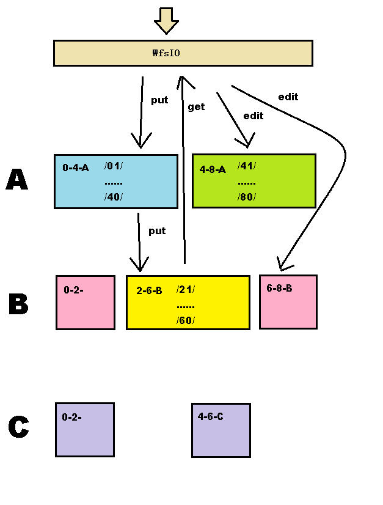

* 分布式文件系统WFS采用Hessian作为服务化协议

* 输入通常为InputStream传输文件流与虚拟路径

* 约定虚拟路径分隔符为"/"，"/"结尾代表目录，非"/"结尾代表文件

* 文件系统将虚拟路径计算hash值做为真实存储的文件名，内容为虚拟文件原始内容，这样保证了再次读取虚拟文件通hash值能找到同一文件；目录则为文件夹名，文件夹之下记录着该虚拟目录下的虚拟文件或虚拟子目录，名称为虚拟文件名或虚拟目录名，文件为空文件，子目录为空目录，这样保证了查看目录列表时能够看到虚拟目录下的文件级子目录；虚拟目录不存在则自动递归建虚拟目录。

* 分布式与冗余：参考 base-route的README.md，这里用到里面的@HashRouter与@WfsRouter。分布式：hash值前两位将hash文件与hash目录放至以前两位文件名命名的物理目录下，这样有01~80，128个目录，每台节点占有一定范围的目录；冗余：同时每台节点只在其中一层，不同层内容相同以冗余，可将层名命名为字母如A、B、C。这样配置路由程序将文件放至对应的节点之上。

* 在此之前各节点提供服务将原始请求接下，再转请求。带流写入的服务如put将采用按层名字母顺序层层传输@WfsRoute；带流读取服务如getList，get将采用失败后再找其它提供者@HashRouter；剩下的目录操作等不带流的服务(edit)则采用并发调用所有符合的提供方

* 关于灾备恢复与扩容，每台节点另外提供服务用于其它节点恢复；启动默认按配置中的目录逐个同步，如果发现有其它提供者，该提供者返回该物理目录下文件列表及子目录，建立目录与空文件之后，逐个同步不存在的实体文件。扩容即改变配置再恢复同步即可，见wfs_restore.png。

* 可改进点，hash目录为64位，应扩至128位。灾备同步实体文件应按时间戳或md5确定是否同步。可按文件内容md5做为物理文件名，而md5值记录在目录下的空文件中，同时记录日期等，以高效处理重命名与重复文件。

## 例

* 冗余两份，共部署四节点，那么配置建议分别为0-4-A、4-8-A、0-2-6-8-B、2-6-B
* 虚拟放置文件file于，虚拟目录/home/dir/目录下。
* /的hash值为28341e048c754772，/home/的hash值为70287f0046e2d90a，/home/dir/的hash值为3a99cfaa0a24e0b9，/home/dir/file的hash值为221a52f2ce082efd，
* 将在0-4-A与2-6-B的28目录产生28341e048c754772文件夹，文件夹下有名为home的空目录，
* 将在4-8-A与0-2-6-8-B的70目录产生70287f0046e2d90a文件夹，文件夹下有名为dir的空目录，
* 将在0-4-A与2-6-B的3a目录产生3a99cfaa0a24e0b9文件夹，文件夹下有名为file的空文件，
* 将在0-4-A与2-6-B的22目录产生221a52f2ce082efd文件，内容为file文件的内容，这样调用get服务接口传/home/dir/file虚拟路径参数返回该文件流
